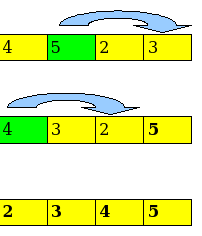

# Funzione ricorsive

A volte capita di avere a che fare con problemi che sono difficilmente
risolvibili ricorrendo a funzioni imperative "standard". In alcuni casi, invece
di avere una visione "di insieme" del problema da risolvere può essere più
comodo avere una visione "particolareggiata", progettare un algoritmo che
risolva parte del problema e ripetere quest'algoritmo finché il problema non è
risolto del tutto.

## Esempio informale di ricorsione

Un esempio pratico: immaginiamo di dover ordinare un array di numeri in senso
crescente. La soluzione che ci viene in mente ora, senza applicare algoritmi
ricorsivi, è quella di cercare il valore più grande all'interno dell'array,
spostarlo nell'ultima posizione e poi ordinare l'array escludendo il termine
appena "ordinato", e ripetere questa procedura finché l'array non contiene più
nessun elemento da ordinare.



Questo modo però implica una visione “di insieme” del problema, e per questo non
è la più efficiente (è un algoritmo chiamato naive sort).

E se invece dividessimo via via l'array in parti più piccole, fino ad arrivare
ad array contenenti ognuno due elementi? Potremmo ordinare ognuno di questi
mini-array (si tratterebbe al massimo di fare uno scambio tra due elementi),
quindi ricorsivamente in questo modo risalire ad un array ordinato. Questa è la
soluzione più ottimizzata in termini di prestazioni, ed implica un nuovo
approccio alla risoluzione di un problema: un approccio ricorsivo. Dal
particolare (l'ordinamento di array di due elementi) si passa al generale
(l'ordinamento di un intero array di dimensioni maggiori), facendo in modo che
la funzione di ordinamento richiami sempre se stessa (questo è un algoritmo di
merge sort, implementato di default in linguaggi come Java e Perl).

## Esempio pratico di ricorsione

Facciamo un esempio pratico di ricorsione: il classico calcolo del fattoriale.
Il fattoriale di un numero intero n è n! = n*(n-1)*(n-2)*...*1

Con i cicli classici che abbiamo visto finora potremmo scriverlo così:

```c
/* Questo è il main() */
 
int main()  {
    int n;
     
    printf ("Inserire un numero intero: ");
    scanf ("%d",&n);
     
    printf ("Fattoriale di %d: %d\n",n,fat(n));
    return 0;
}
 
/* Questa è la funzione che calcola il fattoriale */
 
int fat(int n)  {
    int i,f=1;
     
    for (i=n; i>0; i--)
        f *= i;
    return f;
}
```

Vediamo ora come riscrivere la funzione fat() in modo ricorsivo, senza nemmeno
usare il ciclo for. Di volta in volta la variabile di appoggio i viene
decrementata di un'unità. Proviamo invece a ragionare in modo ricorsivo:

Ho una variabile n di cui voglio calcolare il fattoriale:

n! = n*(n-1)*(n-2)*...*1  
Ma (n-1)! = (n-1)*(n-2)*...*1 -> n! = n*(n-1)! Ma (n-2)! = (n-2)*(n-3)*...*1 ->
(n-1)! = (n-1)*(n-2)! E così via

Per calcolare il fattoriale di n posso quindi semplicemente moltiplicare n per
il fattoriale di n-1, che a sua volta è n-1 moltiplicato per il fattoriale di
n-2, e così via finché non arrivo a 1.

Ecco l'implementazione:

```c
int fat(int n)  {
    if (n==1)
        return 1;
    else return n*fat(n-1);
}
```

Un'implementazione molto più semplice e immediata.

## Ricorsione tail e non-tail

Una forma di questo tipo di definisce una forma ricorsiva di tipo non-tail. Una
forma ricorsiva si definisce di tipo non-tail quando nella direttiva di ritorno
(return) non compare solo la chiamata alla funzione ricorsiva, ma anche un
parametro (in questo caso n, che viene moltiplicato per la funzione ricorsiva).
Quando invece nella direttiva di ritorno è presente solo la chiamata alla
funzione ricorsiva, allora abbiamo a che fare con una forma ricorsiva di tipo
tail. Facciamo un esempio di funzione che sfrutti una ricorsione di tipo tail.
Vogliamo creare una funzione che, dato un array di interi, ritorna il numero di
elementi nulli al suo interno. Potremmo anche crearla in modo “standard”, con un
normale ciclo for o con un ciclo while:

```c
/*
La funzione countNull accetta come parametri un vettore di
interi e la dimensione del vettore stesso, e ritorna il numero
di zeri contenuti all'interno del vettore
*/
 
int countNull ( int *v, int dim )  {
    int i=0,count=0;
     
    // Se il vettore non ha elementi, ritorna 0
         
    if (!dim)
        return 0;
    else
        // Finché il vettore ha elementi, controllo se
        // l'elemento è zero.  Se sì, incremento la variabile
        // contatore
        for (i=0; i<dim; i++)
            if (!v[i])
                count++;
    return count;
}
```

Ecco invece come strutturare la funzione con una ricorsione tail:

Se la posizione attuale all'interno del vettore è l'ultima, ritorna il numero di
zeri contati nel vettore Se alla posizione attuale all'interno del vettore
corrisponde uno zero, incrementa la variabile contatore Ritorna la funzione
stessa sullo stesso vettore della stessa dimensione ma sull'elemento successivo
nel vettore

```c
int countNull(int *v, int dim, int i)  {
    if (i==dim)
        return zero;
    if (v[i]==0)
        zero++;
    return
        countNull(v,dim,i+1);
}
```

In questo caso, quando richiamiamo la funzione dobbiamo anche specificare il
valore iniziale della variabile i. Poiché vogliamo cominciare dall'inizio del
vettore, i varrà 0.
