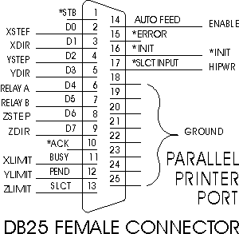
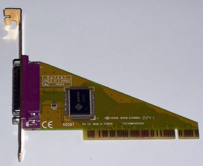
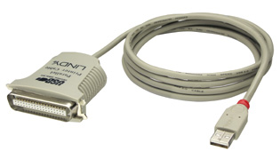
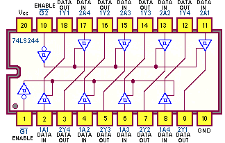

# Programmazione della porta parallela


La porta parallela è una delle principali interfacce I/O su un calcolatore.
Inizialmente usata per connettere la stampante al computer (oggi su molte
macchine moderne questa porta non è neanche più presente in quanto la maggior
parte delle stampanti al giorno d'oggi usano un'interfaccia USB), la porta
parallela è in seguito diventata un interfaccia estremamente utilizzata da
elettronici e informatici per pilotare tramite il calcolatore dispositivi
_self-made_, in virtù dell'estrema facilità di programmazione di
quest'interfaccia.

## Disclaimer

La programmazione della porta parallela è un campo estremamente affascinante, ma
a cui avvicinarsi con cautela. Il chip che gestisce la porta parallela è sulla
scheda madre, e in molti casi gestisce anche altri componenti, quali dischi,
interfacce di I/O ecc. Se non si ha abbastanza esperienza con il saldatore e si
vuole collegare un dispositivo fatto in casa alla parallela, è meglio NON
collegarlo direttamente alla porta parallela sulla scheda madre. Ci vuole poco a
creare un corto circuito che può danneggiare fisicamente e in modo irreparabile
il chip sulla scheda madre, che in genere non è sostituibile e costringe alla
sostituzione fisica dell'intera scheda madre. L'avvertenza è ancora più forte se
si collega il proprio marchingegno elettronico ad un portatile nuovo di zecca.
Ci vuole poco per trasformare il portatile nuovo di zecca in un oggetto da
discarica se tra l'interfaccia di I/O e il proprio circuito collegato si viene a
creare un corto circuito. Il mio consiglio è di interporre tra il proprio
dispositivo e la porta parallela sulla scheda madre un buffer tri-state che
possa proteggere la scheda madre stessa, magari un tri-state integrato come il
pic 74LS44, che ha il seguente schema elettrico:



O, meglio ancora, si può inserire nel proprio slot ISA o PCI della scheda madre
una scheda del genere, che costa una decina di euro:



Se c'è qualcosa di sballato nel circuito salta la scheda PCI e con una decina di
euro si può comprare una nuova, e almeno non salta la scheda madre.

Ancora, se si acquista un computer moderno è probabile che non sia presente
l'interfaccia parallela. In questo caso si può rimediare con un adattatore
USB-parallela come il seguente (una decina di euro):



## Struttura della porta



Su una porta parallela è possibile leggere o scrivere 1 byte (8 bit) per volta,
informazione che viene salvata su un registro interno a 8 bit della porta. I pin
che ci interessano in questa trattazione sono quindi quelli numerati da 2 a 9 (a
ogni pin corrisponde un bit). I pin da 10 a 17 e 1 vengono usati come pin di
controllo, per leggere lo status della porta o inviare segnali, mentre quelli da
18 a 25 sono tutti collegati a massa (tensione di riferimento nulla).

## Individuazione dell'indirizzo della porta parallela

Ogni interfaccia di I/O di un calcolatore è mappata in memoria tramite un range
di indirizzi, range che serve a identificare in modo non ambiguo il dispositivo
e alla comunicazione del sistema con esso. La porta parallela è generalmente
mappata agli indirizzi `0x378-0x37F`. Per essere più sicuri, è meglio
controllare.  Su un sistema Unix ciò è possibile dando un'occhiata al file
`/proc/ioports`. Per la porta parallela dovrebbe comparire una riga del genere:

    0378-037f : lp1

Mentre invece su un sistema Windows si può controllare dalla gestione avanzata
delle periferiche.

## Primitive di sistema per la programmazione del dispositivo

Un sistema Unix mette a disposizione del programmatore una serie di primitive C
per la gestione della porta parallela e non solo. Tramite le primitive che
vedremo in questa sede sarà possibile programmare senza molti problemi qualsiasi
dispositivo di I/O connesso alla propria macchina, ovviamente stando sempre
attenti a quello che si sta facendo.

### ioperm

Primitiva fondamentale per poter aprire un canale di comunicazione con la
periferica di I/O è _ioperm()_, il cui compito è di settare o rimuovere i
permessi di accesso ad una qualsiasi periferica di I/O. Come parametri prende

* L'indirizzo iniziale che identifica la periferica di I/O (`0x378` nel caso
  della porta parallela);
* Il numero di byte assegnati alla periferica a partire dal byte iniziale (in
  genere per la parallela se ne considerano 4);
* Un intero che identifica se attivare o disattivare l'accesso alla periferica
  (1 per poter accedere alla periferica, 0 quando l'accesso non serve più).

C'è da ricordare che per utilizzare questa primitiva è necessario avere i
privilegi di amministratore. Quindi l'applicazione che intende accedere alla
periferica è necessario che sia di proprietà di root e abbia il bit UID settato,
in modo da poter accedere alla periferica con ioperm(). Esempio di uso:

```c
// Indirizzo di partenza della periferica
#define  PORT  0x378
 
...
 
int uid=geteuid();
 
// Se non sono root, setto i privilegi di root
if (uid)
    setreuid(0,0);
     
// Accedo alla periferica
if (ioperm(PORT,3,1)==-1)  {
    perror ("Errore nell'accesso alla periferica\n");
    exit(1);
}
 
// Torno a settare i permessi di utente normale
if (uid)
    setreuid(uid,uid);
```

### inb o outb

Per leggere un byte per volta su una porta di I/O e scriverli il kernel mette a
disposizione le primitive _inb_ e _outb_, utilizzabili nel proprio codice C a
patto di includere l'header `<asm/io.h>` (in quanto sono parallele alle
istruzioni ASM IN e OUT). La loro sintassi è la seguente:

```c
short int inb (int port);
void outb (short int val, int port);
```

_inb_ legge un byte dalla porta all'indirizzo _port_ (precedentemente aperta) e
ritorna il valore letto. _outb_ invece scrive il byte val sulla porta
all'indirizzo _port_.

Per applicazioni diverse dalla porta parallela (che avendo 8 data pin può
interagire con 1 byte per volta) è possibile leggere o scrivere sulla periferica
una word per volta o una double word rispettivamente con le primitive _inw-outw_
o _inl-outl_, che hanno la stessa sintassi di quelle già viste.

## Esempio pratico

Prendiamo un esempio facile facile in esame. Immaginiamo di aver collegato alla
porta parallela un led, collegato in modo che sia polarizzato in diretta
(terminale positivo sul data pin n.1 della porta parallela e terminale negativo
collegato ad un qualsiasi ground pin della porta parallela). Vogliamo che il
nostro led si accenda a intermittenza, diciamo pure con un intervallo di 1
secondo tra un cambiamento e l'altro (in pratica vogliamo sfruttare la porta
parallela come un generatore di onde quadre). La cosa è possibilissima con le
conoscenze che abbiamo finora. Ecco il codice in C:

```c
#include <stdio.h>
#include <stdlib.h>
#include <asm/io.h>
 
// Indirizzo della parallela
#define PORT            0x378
 
main()  {
    // Controllo che utente sono
    int uid=geteuid();
     
    // Se non sono root, acquisisco i privilegi con un setreuid()
    if (uid)
        setreuid(0,0);
     
    // Attivo la porta
    if (ioperm(PORT,3,1)<0)
        exit(1);
     
    // Torno a essere utente normale
    setreuid(uid,uid);
     
    // Ciclo infinito
    while (1) {
        // Scrivo 0000 0001 sulla porta
        // in modo da alimentare solo il data pin n.1
        // dove è collegato il nostro diodo
        outb(0xFF,PORT);
         
        // Aspetto un secondo
        sleep(1);
         
        // Disattivo i data pin scrivendo 0000 0000 sulla porta
        outb(0,PORT);
         
        // Aspetto un secondo
        sleep(1);
    }
}
```
